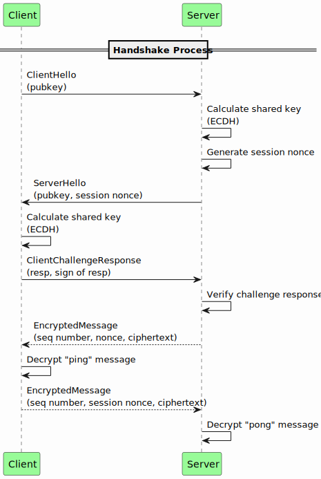
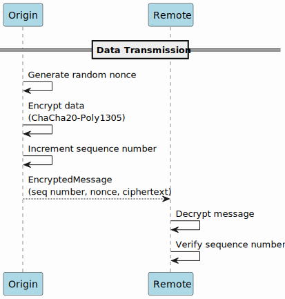

# WhiteProto reference implementation

WhiteProto is a flexible and lightweight encryption protocol designed to provide secure communication between a client and a server. Next section provides an overview of how the WhiteProto protocol works and serves as a reference guide for the WhiteProto reference implementation.

## How the Protocol Works
### Handshake Process



The handshake process is the initial phase of establishing a secure connection between the client and the server. It involves the following steps:

1. **ClientHello**: The client sends a `ClientHello` message to the server, including its public key.

2. **ServerHello**: Upon receiving the `ClientHello` message, the server performs an Elliptic Curve Diffie-Hellman (ECDH) key exchange with the client's public key. The server generates a random 64-bit session nonce for preshared key verification challenge. The server sends the `ServerHello` message to the client, containing the server's public key and the session nonce.

3. **ClientChallengeResponse**: The client calculates the shared key using ECDH and derives a challenge response by concatenating the received nonce and a pre-shared key, then applying the SHA512 hashing function. The client sends the `ClientChallengeResponse` message to the server, containing the response and a signature of the response using the client's private key.

4. **Challenge Response Verification**: The server verifies the challenge response by recomputing it based on the received nonce and the pre-shared key. If the computed response matches the received response, the server proceeds; otherwise, the connection is terminated. If successful, the server encrypts a "ping" message using the shared key and sends an `EncryptedMessage` to the client, including the sequence number, the nonce used for encryption, and the ciphertext.

5. **Ping Decryption**: The client attempts to decrypt the received "ping" message. If the decryption fails, indicating an issue with the shared key, the connection is terminated. The client sends an `EncryptedMessage` to the server, including the sequence number, the session nonce, and the ciphertext of a "pong" message.

6. **Pong Decryption**: The server attempts to decrypt the received "pong" message. If the decryption fails, indicating an issue with the shared key, the connection is terminated.

7. **Handshake Completion**: If the previous steps are successfully completed, the handshake is considered complete, and the connection is now encrypted. Both the client and the server can proceed with secure communication using the shared key.

### Data Transmission




Once the handshake is completed, the client and server can exchange data securely using the WhiteProto protocol. The transmission process involves the following steps:

1. **Encryption**: The origin, which can be either the client or the server, generates a random nonce and encrypts the data using the ChaCha20-Poly1305 symmetric encryption algorithm. The encryption process uses the shared secret, the chosen nonce, and the associated data "whiteproto-seq-{SEQ_NUMBER}". After encrypting the data, the origin increments the sequence number for tracking purposes.

2. **Decryption**: The remote party, which can be either the server or the client receiving the encrypted message, decrypts the message using the shared secret and the received nonce. The remote party also verifies the sequence number to ensure the integrity and order of the received messages.


## Build

### Docker (recommended)
Requires docker

```sh
# Build builder
docker build -f docker/Dockerfile -t whiteproto-builder .

# Build project with builder
docker run -v $PWD:/src whiteproto-builder
```

### Local
Requires ninja, poetry, and protoc 3.19.0+

```sh
scripts/makebuild.py
ninja -v protos
poetry build
```

## Install
Install from artifacts generated at [Build](#build) stage.

```sh
pip install dist/whiteproto-*-py3-none-any.whl
```

## Run examples

### Server
```sh
python examples/server.py
```

### Client
```sh
python examples/client.py
```
